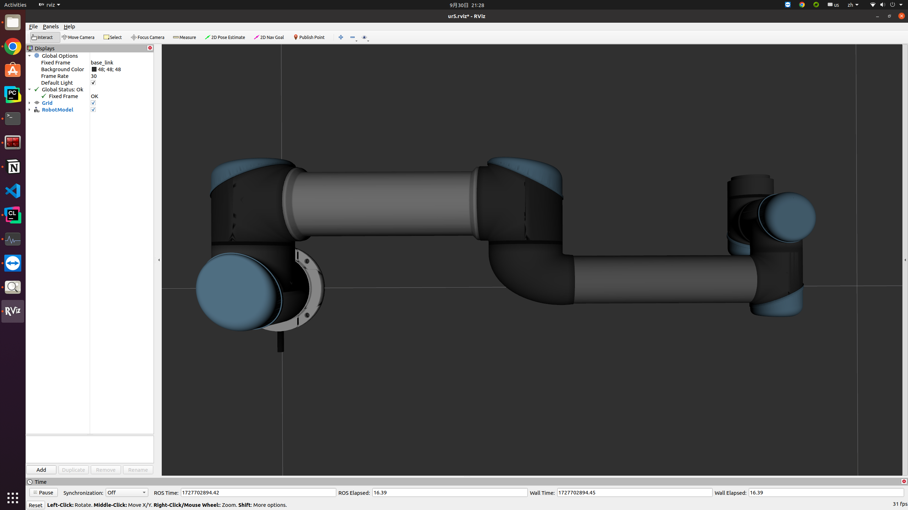
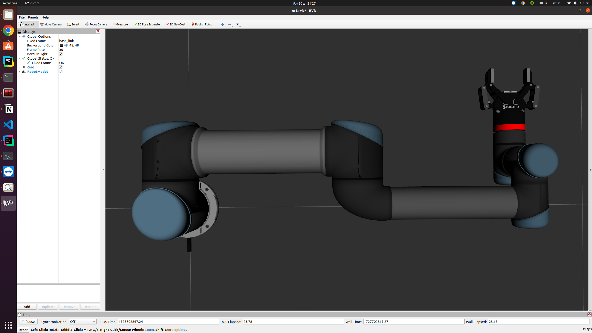
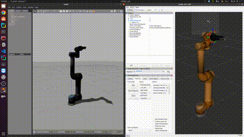
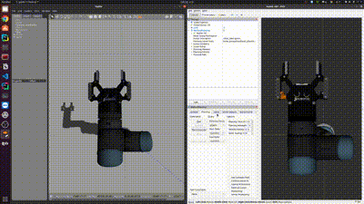

# UR5-Robot

This repository contains URDF and macro files for simulating the UR5 robotic arm and Robotiq85 gripper in Gazebo and other robotic simulators.

## Install

- [ROS Noetic](https://wiki.ros.org/noetic/Installation)
- Gazebo11

```bash
cd ~
mkdir -p grasp_ws/src
cd grasp/src
catkin_init_workspace

git clone https://github.com/llliuxiao/ur5_robot.git
git clone https://github.com/nilseuropa/realsense_ros_gazebo.git

cd ~/grasp_ws
catkin_make
source devel/setup.bash
```

#### Test your install

Executing these commands, rviz will show the gripper, ur5 and ur5-gripper respectively.

```bash
# display robotiq85 gripper
roslaunch robotiq_description display_robotiq85.launch

# display ur5
roslaunch ur5_description display.launch

# display ur5-gripper
roslaunch ur5_description display_with_gripper.launch
```




#### Test UR5 moveit config
```bash
roslaunch ur5_moveit_config demo_gazebo.launch
```

(The pkg was created following [detailed tutorial](https://roboticscasual.com/ros-tutorial-how-to-create-a-moveit-config-for-the-ur5-and-a-gripper/#:~:text=Create%20a%20Moveit%20configuration%20package%20with%20the%20Moveit%20Setup%20Assistant.))

**Control ur5 with MotionPlanning Plugin in rviz**



**Control robotiq-gripper with MotionPlanning Plugin in rviz**




## Reference

- https://github.com/utecrobotics/ur5
- https://github.com/utecrobotics/robotiq
- https://github.com/nilseuropa/realsense_ros_gazebo
- https://roboticscasual.com